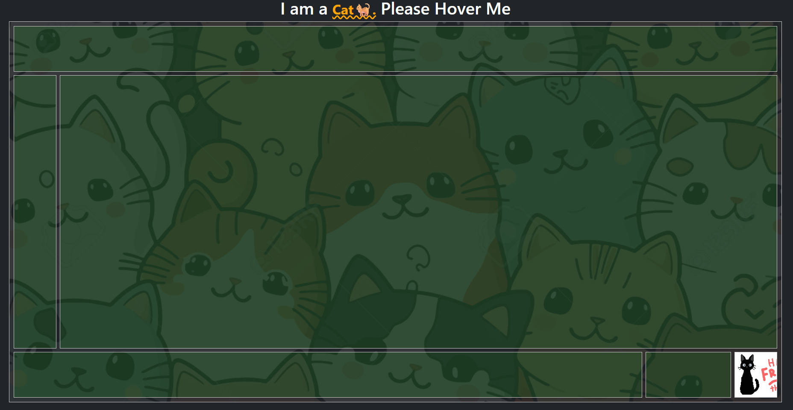

# 🐾 CSS Grid Cat Practice

This project is a fun and creative way to practice **CSS Grid** by building a playful cat-themed layout.  
It’s a simple exercise to understand how grid properties work while making something visually engaging.

## Features

- Hands-on **CSS Grid** practice
- Cute **cat-inspired visual layout**
- Beginner-friendly and easy to customize

## 📸 Preview





## 🛠️ Technologies Used

- **HTML5**
- **CSS3 (CSS Grid)**

## 🎯 Purpose

The main goal of this project is to strengthen my understanding of **CSS Grid** concepts such as:

- Grid rows & columns
- Grid template areas
- Alignment and spacing

## Getting Started

1. Clone the repository.
2. Install dependencies:
   ```bash
   npm install
   ```
3. Start the development server:
   ```bash
   npm start
   ```

## Folder Structure

- `/src` - Source code
- `/public` - Static assets

## License

This project is for educational purposes.

---

Feel free to contribute or ask questions!
